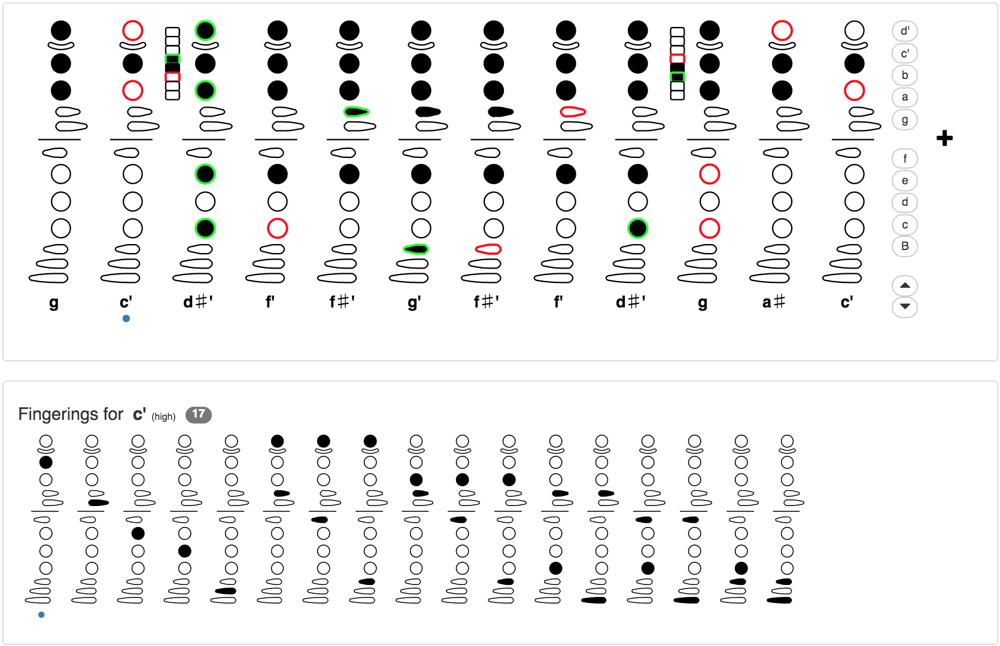

## Fingering Tool for Akai EWI

A tool for exploring fingerings on the Akai EWI. Inspired by Bret Pimentel's [Flexible EWI Fingerings](https://bretpimentel.com/flexible-ewi-fingerings/) and [Fingering Diagram Builder](https://fingering.bretpimentel.com/#!/akaiewi/).

Deployed at http://ewi.malkut.net/

Built with React, Lodash, Bootstrap and WebMidi.

### Example (Take Five)
[](http://ewi.malkut.net/?f=5632,1024,5672,5664,5920,5924,5920,5664,5672,5632,1536,1024,1284,260,1284,1796,1804,1796,1536,1024,1536,5632,5664,5632&r=0,0,1,1,1,1,1,1,1,0,0,0,0,0,0,0,0,0,0,0,0,0,0,0 "Take Five")
(Beginning of "Take Five". Assumes EWI is transposed to E&#9837;)

### Local setup

Requires NodeJS. To get started:
```
npm install
npm start
```

More info about the setup: [README-create-react-app.md](README-create-react-app.md)
